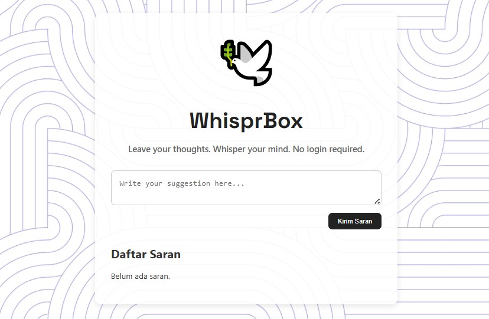

# 🕊️ WhisprBox

> An anonymous suggestion box — no login required!  
> Collect honest feedback easily and securely on the Internet Computer (ICP) ecosystem.

---

## 🚀 Project Overview

WhisprBox is a simple yet elegant web app that allows users to submit anonymous suggestions or feedback without any need to login or register. Built on the Internet Computer platform with a **Motoko backend** and **React frontend**, it offers a natural, user-friendly interface for sharing ideas anonymously.

---

## 🎯 Features

- ✍️ Submit anonymous suggestions without login  
- 📜 View a list of all submitted suggestions  
- 👍👎 Like or dislike each suggestion  
- 🕒 Timestamp for each submission  
- 🔄 Responsive design, works beautifully on desktop and mobile  
- 🎨 Clean, natural UI with custom fonts and background tiles

---

## 🛠️ Tech Stack

- **Backend:** Motoko (IC SDK)  
- **Frontend:** React, Vite, CSS  
- **Deployment:** Internet Computer (DFINITY)  
- **Fonts:** Google Fonts (Inter)  
- **Assets:** Custom SVG favicon and background

---

## 📸 Screenshots



---

## 🛠️ How to Run Locally
 
```
git clone https://github.com/yourusername/WhisprBox.git
cd WhisprBox
npm install
dfx start --background
dfx deploy
```

---

## 📦 Deployment

This project is designed to be deployed on the Internet Computer mainnet. Use the `dfx deploy` command after proper configuration of `dfx.json` and canister IDs.

---

## 🤝 Contributing
Contributions are welcome! Feel free to open issues or pull requests.

---

## 📄 License
This project is licensed under the MIT License.

---

## 🙏 Thanks for checking out WhisprBox!
Feel free to submit anonymous feedback anytime 🕊️

---

Made with ❤️ on the Internet Computer
